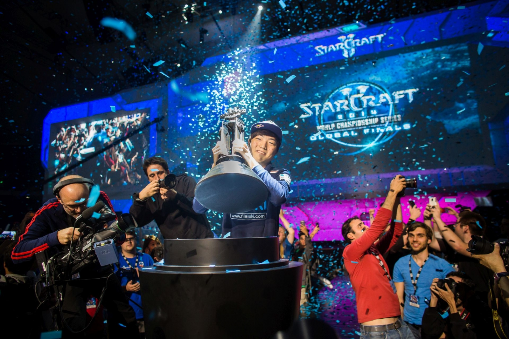
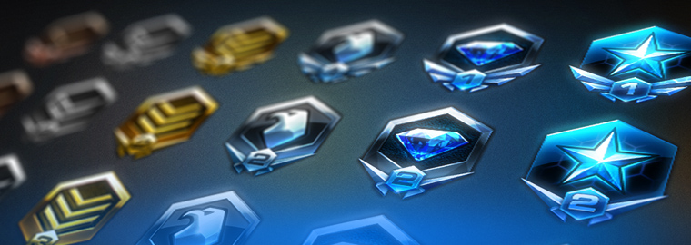

# Python_For_Data_Analysis_Skillcraft1

> Data Analysis of the dataset [SkillCraft1 Master Table Data Set](http://archive.ics.uci.edu/ml/datasets/skillcraft1+master+table+dataset) by Johny LIN @JohnyLn and Jérémy GOLDSCHILD @jgoldschild

## Information and Contexte

StarCraft II  is a science fiction real-time strategy video game developed and published by Blizzard Entertainment.

The StarCraft II video game is a multiplayer game where several players compete in an arena to collect resources, capture strategic points and destroy opposing bases.

StarCraft II has been a success, selling more than six million copies worldwide and establishing itself as a major title in real-time strategy games and electronic sports.

The video game features a ranking system that ranks players based on their performance and victory in competitive matches.
The ranking system is characterized in different leagues from the Bronze league (the lowest level) to the Professional league (a professional level).

Icon | Name Rank | Level
--- | --- | ---
 | Grandmaster | Professional
 | Master | Competitive
 | Diamond | Good
 | Platinum | Medium+
 | Gold | Medium
 | Silver | Medium-
 | Bronze | Low

Its multiplayer mode has been particularly popular, especially in South Korea, where many players have achieved professional status and are still competing in televised games.

## Overview

 Feature | Description | Type
 --- | --- | ---
 GameID | Unique ID number for each game | integer
 LeagueIndex | Bronze, Silver, Gold, Platinum, Diamond, Master, GrandMaster, and Professional leagues Ordinal 1-8 | integer
 Age | Age of each player | integer
HoursPerWeek | Reported hours spent playing per week  | integer
TotalHours |  Reported total hours spent playing  | integer
PM | Action per minute | float
SelectByHotkeys | Number of unit or building selections made using hotkeys per timestamp | float
AssignToHotkeys | Number of units or buildings assigned to hotkeys per timestamp | float
UniqueHotkeys | Number of unique hotkeys used per timestamp | int
MinimapAttacks | Number of attack actions on minimap per timestamp | float
MinimapRightClicks | number of right-clicks on minimap per timestamp | float
NumberOfPACs | Number of PACs per timestamp | float
GapBetweenPACs | Mean duration in milliseconds between PACs | float
ActionLatency | Mean latency from the onset of a PACs to their first action in milliseconds | float
ActionsInPAC | Mean number of actions within each PAC | float
TotalMapExplored | The number of 24x24 game coordinate grids viewed by the player per timestamp | int
WorkersMade | Number of SCVs, drones, and probes trained per timestamp | float
UniqueUnitsMade | Unique unites made per timestamp | int
ComplexUnitsMade | Number of ghosts, infestors, and high templars trained per timestamp | float
ComplexAbilitiesUsed | Abilities requiring specific targeting instructions used per timestamp | float
